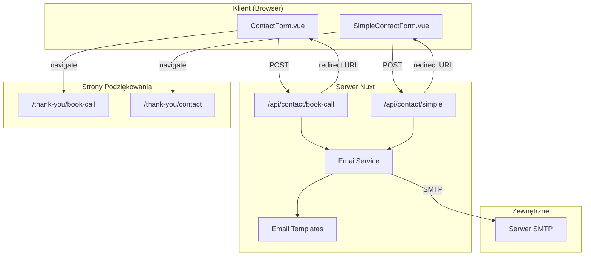

# Dokument Projektowy: Nodemailer Contact Forms

## Przegląd

Ten dokument opisuje architekturę i implementację systemu wysyłki e-maili dla dwóch formularzy kontaktowych w aplikacji Nuxt.js. System wykorzystuje moduł `nuxt-nodemailer` do obsługi SMTP i zapewnia bezpieczną wysyłkę e-maili z potwierdzeniami dla użytkowników oraz powiadomieniami dla właściciela strony.

## Architektura



### Przepływ danych

1. Użytkownik wypełnia formularz i klika "Wyślij"
2. Komponent Vue wysyła żądanie POST do odpowiedniego endpointu API
3. Serwer waliduje dane i sanityzuje input
4. EmailService wysyła dwa e-maile: potwierdzenie do użytkownika i powiadomienie do właściciela
5. API zwraca URL strony podziękowania
6. Klient przekierowuje użytkownika na stronę podziękowania

## Komponenty i Interfejsy

### 1. Konfiguracja Nodemailer

```typescript
// nuxt.config.ts
export default defineNuxtConfig({
  modules: [
    // ... existing modules
    'nuxt-nodemailer'
  ],
  nodemailer: {
    from: process.env.SMTP_FROM,
    host: process.env.SMTP_HOST,
    port: parseInt(process.env.SMTP_PORT || '587'),
    secure: process.env.SMTP_SECURE === 'true',
    auth: {
      user: process.env.SMTP_USER,
      pass: process.env.SMTP_PASS
    }
  }
})
```

### 2. API Endpoints

#### `/api/contact/book-call.post.ts`

```typescript
interface BookCallRequest {
  name: string
  email: string
  phone: string
  lookingFor?: string
  photographyStyle?: string
  additionalNotes?: string
  locale: 'en' | 'nb'
}

interface ContactResponse {
  success: boolean
  redirectUrl?: string
  error?: string
}
```

#### `/api/contact/simple.post.ts`

```typescript
interface SimpleContactRequest {
  name: string
  email: string
  message: string
  locale: 'en' | 'nb'
}

interface ContactResponse {
  success: boolean
  redirectUrl?: string
  error?: string
}
```

### 3. Email Service

```typescript
// server/utils/emailService.ts
interface EmailOptions {
  to: string
  subject: string
  html: string
  text: string
}

interface EmailService {
  sendConfirmationEmail(data: ConfirmationEmailData): Promise<void>
  sendNotificationEmail(data: NotificationEmailData): Promise<void>
}
```

### 4. Komponenty Vue (zaktualizowane)

```typescript
// ContactForm.vue - zaktualizowany handleSubmit
const handleSubmit = async (data: ContactFormData) => {
  isLoading.value = true
  error.value = null
  
  try {
    const response = await $fetch('/api/contact/book-call', {
      method: 'POST',
      body: { ...data, locale: locale.value }
    })
    
    if (response.success && response.redirectUrl) {
      await navigateTo(response.redirectUrl)
    }
  } catch (e) {
    error.value = t('bookCall.form.error')
  } finally {
    isLoading.value = false
  }
}
```

## Modele Danych

### Schemat walidacji dla Book Call

```typescript
// server/schemas/bookCallSchema.ts
import { z } from 'zod'

export const bookCallSchema = z.object({
  name: z.string().min(2).max(100),
  email: z.string().email().max(255),
  phone: z.string().min(8).max(20),
  lookingFor: z.enum(['businessGift', 'fineArtPrint', 'customPhotography']).optional(),
  photographyStyle: z.enum(['landscape', 'architecture', 'nature', 'impressions', 'other']).optional(),
  additionalNotes: z.string().max(2000).optional(),
  locale: z.enum(['en', 'nb'])
})

export type BookCallData = z.infer<typeof bookCallSchema>
```

### Schemat walidacji dla Simple Contact

```typescript
// server/schemas/simpleContactSchema.ts
import { z } from 'zod'

export const simpleContactSchema = z.object({
  name: z.string().min(2).max(100),
  email: z.string().email().max(255),
  message: z.string().min(10).max(5000),
  locale: z.enum(['en', 'nb'])
})

export type SimpleContactData = z.infer<typeof simpleContactSchema>
```

### Struktura szablonów e-mail

```typescript
// server/templates/emailTemplates.ts
interface EmailTemplateData {
  recipientName: string
  locale: 'en' | 'nb'
  formType: 'book-call' | 'contact'
}

interface ConfirmationTemplateData extends EmailTemplateData {
  // Dane specyficzne dla potwierdzenia
}

interface NotificationTemplateData extends EmailTemplateData {
  formData: Record<string, string>
  submittedAt: Date
}
```

### Tłumaczenia dla stron podziękowania

```typescript
// Struktura w i18n/locales/en.json
{
  "thankYou": {
    "bookCall": {
      "title": "Thank You!",
      "message": "We've received your consultation request.",
      "nextSteps": "We'll contact you within 48 hours to schedule your free consultation.",
      "backHome": "Back to Home"
    },
    "contact": {
      "title": "Message Sent!",
      "message": "Thank you for reaching out.",
      "nextSteps": "We'll get back to you as soon as possible.",
      "backHome": "Back to Home"
    }
  }
}
```


## Właściwości Poprawności (Correctness Properties)

*Właściwość to cecha lub zachowanie, które powinno być prawdziwe dla wszystkich poprawnych wykonań systemu - zasadniczo formalne stwierdzenie o tym, co system powinien robić. Właściwości służą jako pomost między specyfikacjami czytelnymi dla człowieka a gwarancjami poprawności weryfikowalnymi maszynowo.*

### Property 1: Walidacja danych formularza

*Dla dowolnych* danych wejściowych formularza, jeśli wymagane pola (name, email, phone/message) są puste lub email ma niepoprawny format, system SHALL odrzucić żądanie i zwrócić błąd walidacji.

**Validates: Requirements 2.6, 3.6, 7.1**

### Property 2: Wysyłka emaili dla poprawnych danych

*Dla dowolnych* poprawnych danych formularza (book-call lub simple), system SHALL wysłać dokładnie dwa emaile: jeden Email_Potwierdzenia do nadawcy i jeden Email_Powiadomienia do właściciela strony.

**Validates: Requirements 2.2, 2.3, 3.2, 3.3**

### Property 3: Odpowiedź API z URL przekierowania

*Dla dowolnego* pomyślnego przetworzenia formularza, odpowiedź API SHALL zawierać `success: true` oraz `redirectUrl` wskazujący na odpowiednią stronę podziękowania dla danego typu formularza i locale.

**Validates: Requirements 2.4, 3.4**

### Property 4: Lokalizacja Email_Potwierdzenia

*Dla dowolnego* locale (en lub nb) i dowolnych poprawnych danych formularza, Email_Potwierdzenia SHALL zawierać imię nadawcy oraz treść w języku odpowiadającym przekazanemu locale.

**Validates: Requirements 6.1, 6.2**

### Property 5: Kompletność Email_Powiadomienia

*Dla dowolnych* poprawnych danych formularza, Email_Powiadomienia SHALL zawierać wszystkie przesłane pola formularza oraz identyfikator źródła (book-call lub contact).

**Validates: Requirements 6.3, 6.4**

### Property 6: Sanityzacja danych wejściowych

*Dla dowolnych* danych wejściowych zawierających potencjalnie niebezpieczne znaki HTML/JavaScript, system SHALL zneutralizować te znaki przed użyciem w treści emaila.

**Validates: Requirements 7.2**

### Property 7: Lokalizacja stron podziękowania

*Dla dowolnego* locale (en lub nb), strona podziękowania SHALL wyświetlać treść w języku odpowiadającym aktualnemu locale użytkownika.

**Validates: Requirements 4.3**

## Obsługa Błędów

### Błędy walidacji

| Scenariusz | Kod HTTP | Odpowiedź |
|------------|----------|-----------|
| Brakujące wymagane pole | 400 | `{ success: false, error: "validation_error", field: "name" }` |
| Niepoprawny format email | 400 | `{ success: false, error: "invalid_email" }` |
| Zbyt długa wiadomość | 400 | `{ success: false, error: "message_too_long" }` |

### Błędy wysyłki email

| Scenariusz | Kod HTTP | Odpowiedź |
|------------|----------|-----------|
| Błąd połączenia SMTP | 500 | `{ success: false, error: "email_send_failed" }` |
| Timeout | 500 | `{ success: false, error: "email_timeout" }` |
| Niepoprawna konfiguracja | 500 | `{ success: false, error: "configuration_error" }` |

### Strategia retry

- System NIE będzie automatycznie ponawiać wysyłki emaili
- W przypadku błędu, użytkownik zostanie poinformowany i może spróbować ponownie
- Logi błędów będą zapisywane do celów diagnostycznych

## Strategia Testowania

### Podejście dwutorowe

System będzie testowany przy użyciu zarówno testów jednostkowych jak i testów właściwości (property-based tests). Oba podejścia są komplementarne:

- **Testy jednostkowe**: Weryfikują konkretne przykłady, edge cases i warunki błędów
- **Testy właściwości**: Weryfikują uniwersalne właściwości dla wszystkich możliwych inputów

### Konfiguracja testów właściwości

- Biblioteka: `fast-check` dla TypeScript
- Minimum 100 iteracji na test właściwości
- Każdy test właściwości będzie oznaczony komentarzem referencyjnym do dokumentu projektowego

Format tagów: **Feature: nodemailer-contact-forms, Property {number}: {property_text}**

### Zakres testów jednostkowych

1. **Walidacja schematów**
   - Poprawne dane przechodzą walidację
   - Brakujące pola są odrzucane
   - Niepoprawne formaty są odrzucane

2. **Generowanie szablonów email**
   - Szablony zawierają wymagane dane
   - Lokalizacja działa poprawnie
   - HTML i plain text są generowane

3. **Integracja API**
   - Endpointy odpowiadają na POST
   - Poprawne odpowiedzi dla sukcesu i błędów

### Zakres testów właściwości

1. **Property 1**: Walidacja odrzuca niepoprawne dane
2. **Property 4**: Lokalizacja emaili potwierdzenia
3. **Property 5**: Kompletność emaili powiadomienia
4. **Property 6**: Sanityzacja niebezpiecznych znaków

### Mockowanie

- Wysyłka SMTP będzie mockowana w testach
- Testy będą weryfikować wywołania funkcji wysyłki z poprawnymi parametrami
